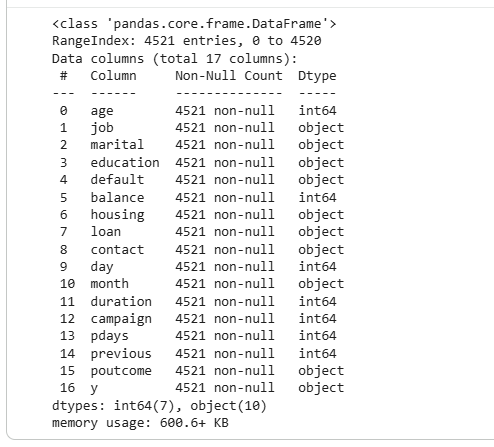
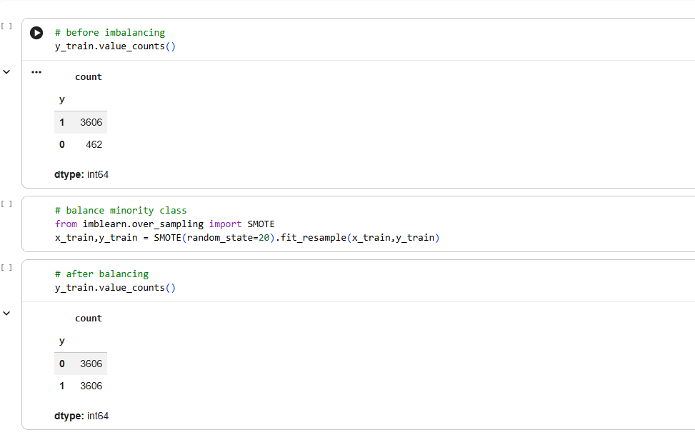
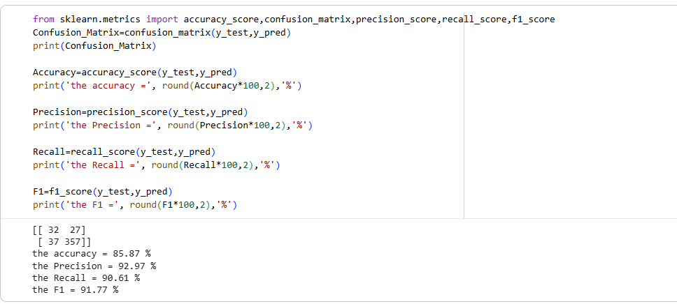
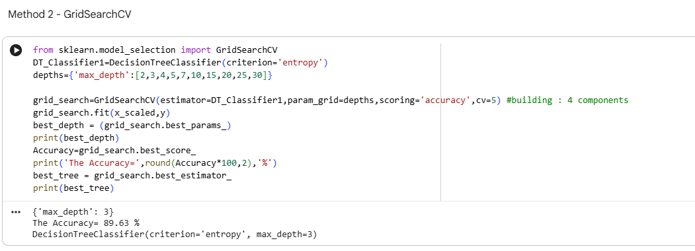
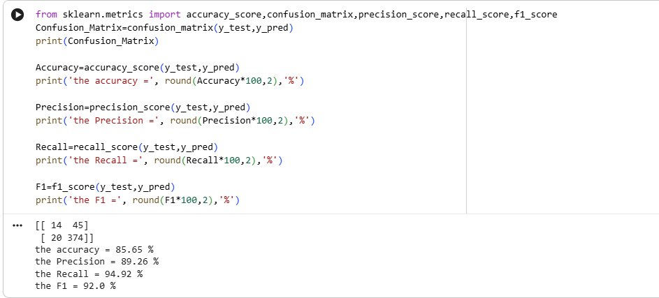
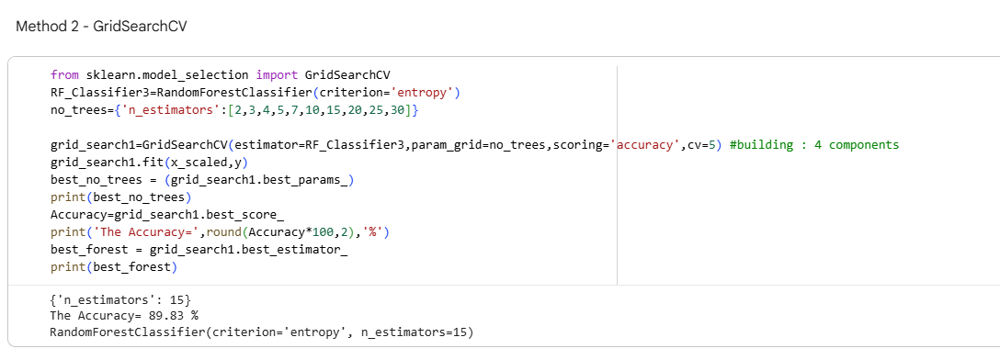
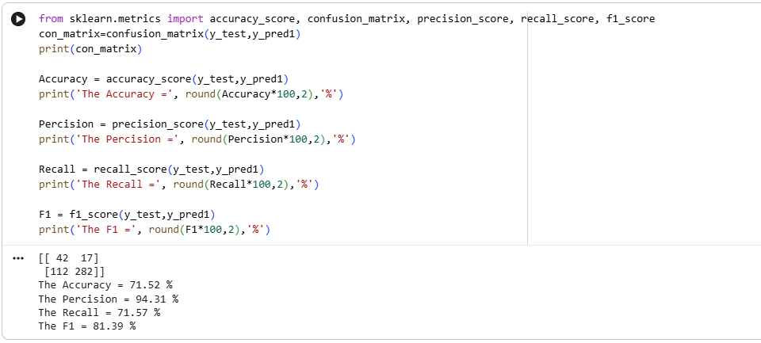
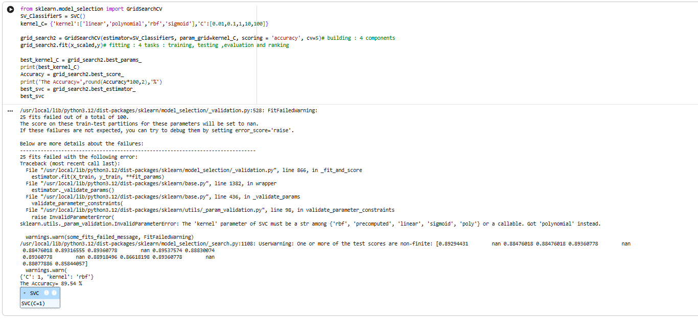
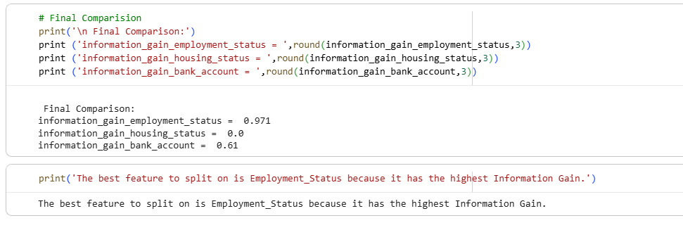

# 🏦 Bank Marketing Classification using Machine Learning

## 📌 Project Overview

This project applies machine learning classification techniques to a bank marketing dataset to predict whether a client will subscribe to a term deposit.

The project was completed as part of the **Applied Statistics and Machine Learning** module and consists of two analytical tasks:

- **Task 1 – Information Gain Analysis:** Calculating entropy and information gain to determine the most suitable attribute for the first split of a Decision Tree.
- **Task 2 – Bank Marketing Classification:** Building and evaluating Decision Tree, Random Forest and Support Vector Machine (SVM) classification models.

The project demonstrates data preprocessing, feature encoding, feature scaling, class imbalance handling using SMOTE, machine learning classification, model evaluation and hyperparameter tuning using GridSearchCV.

---

## 🎯 Project Objectives

- Explore and preprocess bank marketing data.
- Convert categorical variables into machine-readable features.
- Standardize numerical and encoded features.
- Address class imbalance using SMOTE.
- Build multiple classification models.
- Evaluate models using Accuracy, Precision, Recall and F1-score.
- Perform hyperparameter tuning using GridSearchCV.
- Compare model performance and identify the strongest model.
- Apply entropy and Information Gain concepts for Decision Tree feature selection.

---

## 📊 Dataset

The Bank Marketing dataset contains:

- **4,521 records**
- **17 original attributes**
- Customer demographic information
- Financial information
- Previous campaign information
- Marketing interaction information
- Term-deposit subscription outcome

Some of the variables include:

`age`, `job`, `marital`, `education`, `balance`, `housing`, `loan`, `contact`, `duration`, `campaign`, `pdays`, `previous`, `poutcome` and `y`.

The target variable **`y`** represents the term-deposit subscription outcome.

### Dataset Overview



---

## ⚙️ Data Preprocessing

The preprocessing workflow included:

1. Loading and inspecting the dataset.
2. Checking dataset structure and missing values.
3. Encoding binary categorical variables.
4. Applying one-hot encoding to multi-category variables.
5. Separating the input features and target variable.
6. Applying `StandardScaler` to standardize features.
7. Splitting the dataset into training and testing sets.
8. Applying **SMOTE** to the training data to address class imbalance.

### SMOTE Class Balancing



---

## 🤖 Machine Learning Models

Three classification algorithms were implemented and compared.

### 1. Decision Tree Classifier

A Decision Tree classifier using the entropy criterion was trained to predict the target class.

The model was evaluated using:

- Confusion Matrix
- Accuracy
- Precision
- Recall
- F1-score



### Decision Tree Hyperparameter Tuning

GridSearchCV was used to explore different values of `max_depth` and identify an appropriate Decision Tree configuration.



---

### 2. Random Forest Classifier

Random Forest was used as an ensemble classification technique to improve predictive performance and stability.

The model was evaluated using the same classification metrics for consistent model comparison.



### Random Forest Hyperparameter Tuning

GridSearchCV was used to evaluate different values for the number of estimators (`n_estimators`).



---

### 3. Support Vector Machine (SVM)

A Support Vector Machine classifier was implemented as the third classification approach.

The model was evaluated using Accuracy, Precision, Recall and F1-score.



### SVM Hyperparameter Tuning

GridSearchCV was used to compare different kernel and `C` configurations.



---

## 📈 Model Evaluation

The models were evaluated using four classification metrics:

| Metric | Purpose |
|---|---|
| **Accuracy** | Measures the overall proportion of correct predictions |
| **Precision** | Measures how many predicted positive cases were correct |
| **Recall** | Measures how many actual positive cases were correctly identified |
| **F1-score** | Provides a balance between Precision and Recall |

### Model Performance Comparison

| Model | Accuracy | Precision | Recall | F1-score |
|---|---:|---:|---:|---:|
| Decision Tree | 85.87% | 92.97% | 90.61% | 91.77% |
| Random Forest | 85.65% | 89.26% | **94.92%** | **92.00%** |
| SVM | 71.52% | **94.31%** | 71.57% | 81.39% |

The Decision Tree achieved the highest test accuracy at **85.87%**, while Random Forest achieved the highest recall (**94.92%**) and F1-score (**92.00%**). SVM produced the highest precision (**94.31%**) but comparatively lower recall and F1-score.

Because the dataset contains class imbalance, **F1-score was considered an important metric** when comparing the models. Based on this metric, Random Forest provided the strongest balance between Precision and Recall in this analysis.

### GridSearchCV Results

| Model | Best Parameters | Cross-Validation Accuracy |
|---|---|---:|
| Decision Tree | `max_depth = 3` | 89.63% |
| Random Forest | `n_estimators = 15` | **89.83%** |
| SVM | `kernel = 'rbf', C = 1` | 89.54% |

---

## 🌳 Information Gain Analysis

A separate task explored the theoretical foundation of Decision Trees using **Entropy and Information Gain**.

Information Gain was calculated for:

- Employment Status
- Housing Status
- Bank Account

The analysis found that **Employment Status produced the highest Information Gain**, making it the most suitable feature for the first Decision Tree split in the given example.



---

## 🛠️ Technologies & Libraries

- Python
- Pandas
- NumPy
- Scikit-learn
- Imbalanced-learn (SMOTE)
- Decision Tree
- Random Forest
- Support Vector Machine (SVM)
- GridSearchCV
- StandardScaler
- Google Colab

---

## 📁 Repository Structure

```text
bank-marketing-classification/
│
├── code/
│   ├── information-gain-analysis.py
│   └── bank-marketing-classification.py
│
├── data/
│   └── bank-marketing-dataset.csv
│
├── screenshots/
│   ├── 01-dataset_overview.png
│   ├── 02-smote_class_balancing.png
│   ├── 03-decision_tree_results.png
│   ├── 04-decision_tree_gridsearch.png
│   ├── 05-random_forest_results.png
│   ├── 06-random_forest_gridsearch.png
│   ├── 07-svm_results.png
│   ├── 08-svm_gridsearch.png
│   └── 09-information_gain_results.png
│
└── README.md
```

---

## 🔗 Google Colab

### Task 1 – Information Gain Analysis
[Open Information Gain Analysis in Google Colab](https://colab.research.google.com/drive/1mSikPyYjKN-6d8QQcA7pY6RVUbFEUU4B)

### Task 2 – Bank Marketing Classification
[Open Bank Marketing Classification in Google Colab](https://colab.research.google.com/drive/1y02iY8vy7kpANLGC7u54Cn5t2ZW0LTot)

---

## 💡 Key Learning Outcomes

Through this project, I gained practical experience in:

- Preparing categorical data for machine learning.
- Handling imbalanced classification datasets using SMOTE.
- Implementing multiple classification algorithms.
- Evaluating classification models using multiple performance metrics.
- Applying GridSearchCV for hyperparameter tuning.
- Comparing model performance.
- Understanding entropy and Information Gain in Decision Trees.
- Translating statistical and machine learning concepts into a practical business classification problem.

---

## 👩‍💻 Author

**Varsha Sundararaj**  
MSc Business Analytics  
Dublin Business School, Ireland

## 🔗 Connect With Me
- LinkedIn: https://www.linkedin.com/in/varsha-sundararaj-40a463201
- GitHub: https://github.com/varshasundararaj-analytics
